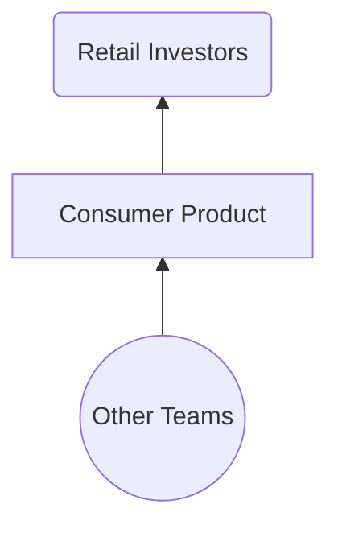
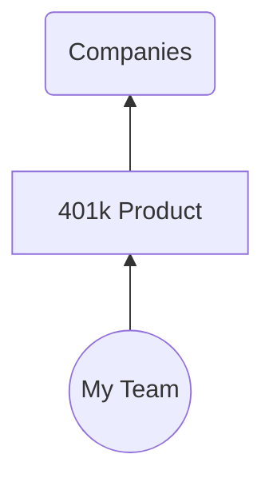
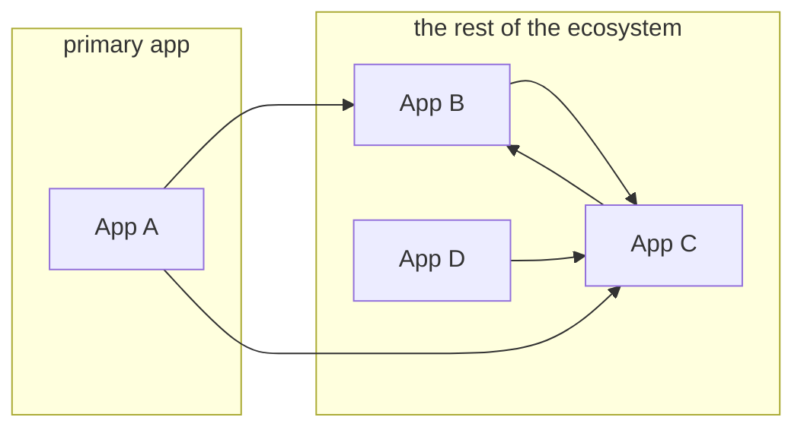
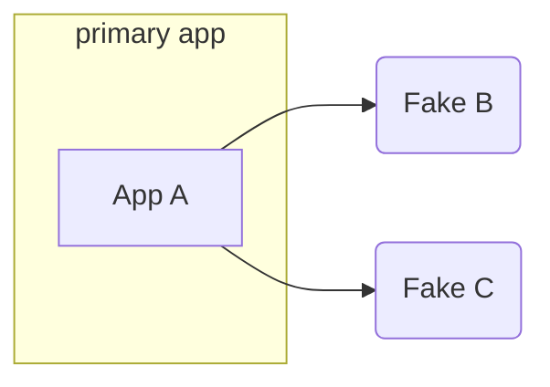
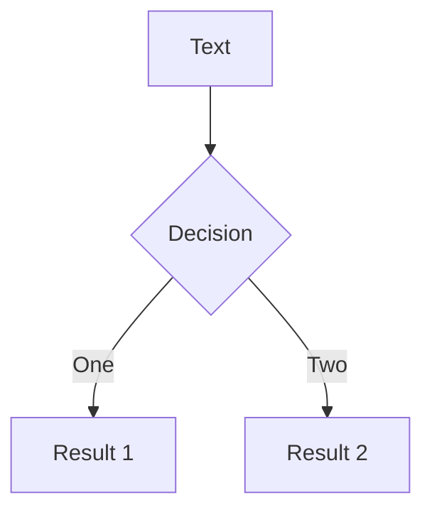

# **RAILS_ENV=demo**

#### unlocking the potential of the "demo" environment

<!--
Okay, so let's get started.

Hello. Welcome. I'm Nathan. I'm glad to be here.
A little nervous, too.

This is actually my first live conference talk.

I gave one last year, but it was prerecorded, so I spent like a week recording over and over trying to get the perfect take. Would definitely not recommend, so I'm more than happy to YOLO this one with you all today.
-->

---
layout: section
---

# RAILS_ENV=demo

<!--
Okay, so you might be here because you saw the title of this talk

RAILS_ENV=demo

and something about it intrigued you.

Or maybe you just picked a room at random. I don't know why you're here.

And so let's just unpack this.
-->

---
layout: fact
---

## **RAILS_ENV=<ins>demo</ins>** bundle exec rails s

<!--
What I'm referring to is the environment variable used to control the mode that your Rails app starts in.
-->

---
layout: fact
---

## **RAILS_ENV=<ins>development</ins>** bundle exec rails s

<!--
Now, usually that's development.
-->

---
layout: fact
---

## **RAILS_ENV=<ins>test</ins>** bundle exec rails s

<!--
Or test
-->

---
layout: fact
---

## **RAILS_ENV=<ins>production</ins>** bundle exec rails s

<!--
Or production, like when you deploy your app somewhere.
-->

---
layout: fact
---

## **RAILS_ENV=<ins>staging</ins>** bundle exec rails s

<!--
Some teams might also have a staging environment.
-->

---
layout: fact
---

## ~~**RAILS_ENV=<ins>staging</ins>** bundle exec rails s~~

<!--
But that's actually not one of the built-ins.
-->

---
layout: fact
---

## RAILS_ENV={**development**, **production**, **test**}

<!--
Out of the box you get the big three: development, production, and test.
-->

---
layout: center
---

```bash
$ ls config/environments/

  development.rb
  production.rb
  test.rb
```

<style>
pre {
font-size: 200% !important;
line-height: 120% !important;
}
</style>

<!--
and these environments correspond to
files live in your config-slash-environments folder
-->

---
layout: center
---

### config/environments/production.rb

```ruby
Rails.application.configure do
  config.cache_classes = true
  config.eager_load = true

  config.consider_all_requests_local = false
  config.action_controller.perform_caching = true

  config.assets.compile = false

  config.log_level = :info
  config.log_tags = %i(request_id)

  # ...
end
```

<!--
And then contained within these files are the actual *instructions* for how your app should behave in each environment.
-->

---
layout: fact
---

## RAILS_ENV={**demo**, development, test, production}

<!--
And so what I'm going to be talking about today is this idea of adding a new, dedicated environment -- called "demo" -- for giving application demos.
-->

---
layout: center
---

```bash {3}
$ ls config/environments/

  demo.rb
  development.rb
  production.rb
  test.rb
```

<style>
pre {
font-size: 200% !important;
line-height: 120% !important;
}
</style>

<!--
And I wish I could say it were as simple as just adding a new demo.rb file, but that's just the beginning.
-->

---
layout: section
---

# Why?

<!--
So why though? Why am I here, talking about environment files?

Well, speaking as someone who loves building Rails apps,
and has been building them for 14 years, I want to make it easy to show off
the things that I build. Like, to friends, coworkers, my parents, you name it.

And if you build Rails apps, you can probably relate to that. I'm sure my parents
would love to get a demo of your app.

But more specifically, I want to tell you the story of a particular demo
environment that I and my team have been working on for almost six years.

And so who am I?
-->

---
layout: image-left
image: /images/me.jpg
---

# Nathan Griffith

GitHub: <a href="https://github.com/smudge">@smudge</a><br/>
Twitter: <a href="https://twitter.com/smudgethefirst">@smudgethefirst</a><br/>
Homepage: <a href="https://ngriffith.com">ngriffith.com</a>

<!--
Well, let me introduce myself.

My name is Nathan. I exist online in a few places.

I also exist in real life, and I work at a company called Betterment.
-->

---
layout: center
---


<!--
You might've heard of us. We offer financial advice, investing accounts, checking,
retirement, you name it.
I like to say that our top product is financial peace of mind. Oh, also, we're hiring.

And I work on the application platform teams at Betterment.
We focus on a lot of cross-cutting concerns, and we
provide our product teams with more of a day-to-day peace of mind.

But I haven't always worked on this team.
-->

---
layout: section
---

# 2016

<!--
Now, the story I want to tell starts in 2016, when I first joined Betterment.
-->

---
layout: fact
---

## 401(k)

<!--
And back then, I was on a different team, helping build Betterment's 401k offering,
now known as Betterment @ Work.
-->

---
layout: two-cols
class: px-40
---

::right::




<!--
And so while most people think of Betterment as a B2C business.
Like, financial services for everyday people like me and my parents.
(The industry calls them "retail investors")
-->

---
layout: two-cols
class: px-40
---



::right::


<!--

The thing my team was building was actually a B2B product.
Because our customers were companies, who might want to offer 401k plans to their employees.
-->

---

<!--
And, look, I'm not on the business side of things.
I'm just a humble software engineer, and so I'm not gonna
try to explain why things work this way.

But if there's one thing I know about B2B businesses,
it's that they do a lot of product demos.

And so we found ourselves in a position where, we 
really wanted to SHOW OFF Betterment's consumer product
to all of our new and prospective business clients.
-->

---

<!--
-->

---

<div class="grid grid-cols-3">


<div>

# Decisions:

<v-clicks>

- **Services**  
- **Database**  
- **Users**  
- **Deployments**  
- **Ownership**  

</v-clicks>

</div><div>

# Demo v1

<v-clicks>

- all of them  
- refreshed nightly  
- fixtures/seeds  
- as needed
- single team  

</v-clicks>

</div>
</div>


<!--
…was deployed as a "complete" environment (alongside "demo"/sandbox instances of all external services and collaborators).
…relied on having pre-seeded, "known" accounts (which could be generated by fixtures or by sanitizing staging/production data), and was periodically wiped clean and reset.
…was deployed only weekly, then monthly, and then via "push button" (perhaps better described as "push button and cross fingers").
…was maintained solely by the team closest to the need for its existence (the team incentivized to do the work).
-->

---
layout: two-cols
---
# Demo v1

- ~~A complete service ecosystem~~
- Pre-seeded user accounts
- Infrequent deployments
- Managed by a specific team

::right::

# Demo v2

- A standalone Rails app with **Stateful Fakes**

---
layout: two-cols
class: text-center
---


# Without Fakes:

<v-click>




</v-click>

::right::


# With Fakes:

<v-click>



</v-click>

---

# How?

- Webmock
- WebValve

---

# WebValve

```ruby
class FakeBank < WebValve::FakeService
  get '/widgets' do
    json result: 'it works!'
  end
end
```

---

# "Stateful" Fakes

- Real database models, fake data

---


---
layout: image-right
image: https://source.unsplash.com/collection/94734566/1920x1080
---

# Code

---

# Components

---
class: px-40
---

# Two Columns

This is me, **testing a two col approach**

<div grid="~ cols-2 gap-2" m="-t-2">

```yaml
---
theme: default
---
```

```yaml
---
theme: seriph
---
```

# Test1

# Test2

<div>

- list 1
- yay
- boo

</div>

<div>

- list2
- boo
- yay

</div>

</div>

---
layout: center
class: text-center
---

<div class="grid grid-cols-3">

<div></div>



<div></div>

</div>


---
layout: center
class: text-center
---

# Learn More

[Documentations](https://sli.dev) · [GitHub](https://github.com/slidevjs/slidev) · [Showcases](https://sli.dev/showcases.html)
