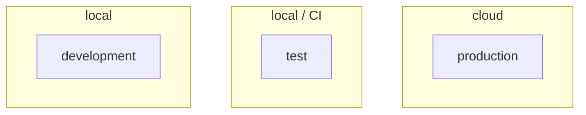
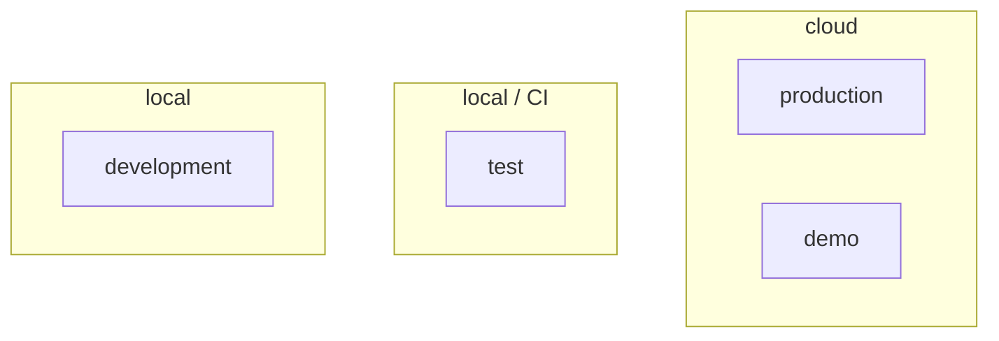
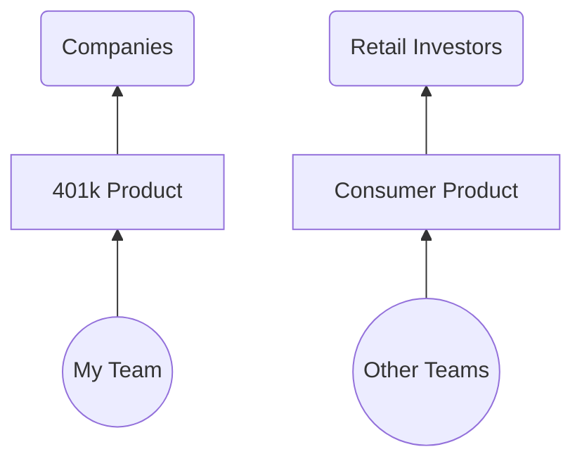
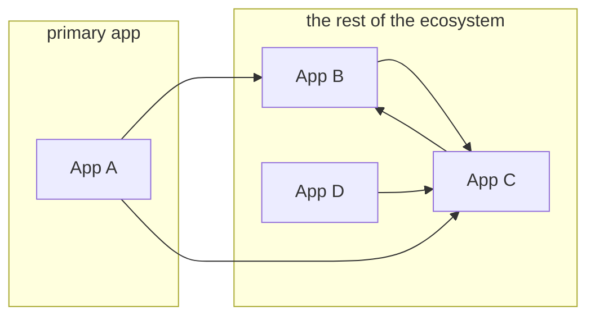
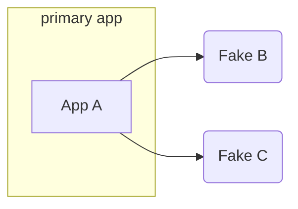
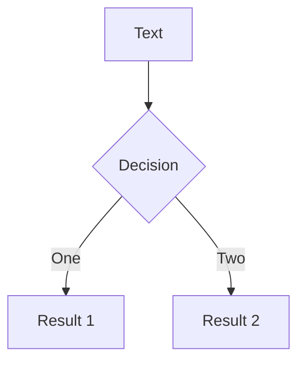

# **RAILS_ENV=demo**

#### unlocking the potential of the "demo" environment

<!--
Hello. Welcome. I'm glad to be here.
-->

---
layout: image-left
image: /images/me.jpg
---

# Nathan Griffith

GitHub: <a href="https://github.com/smudge">@smudge</a><br/>
Twitter: <a href="https://twitter.com/smudgethefirst">@smudgethefirst</a><br/>
Homepage: <a href="https://ngriffith.com">ngriffith.com</a>

<!--
Quick intro: My name is Nathan. I can be found online.

I work for Betterment, and we're hiring!
-->
---
layout: fact
---

# RAILS_ENV=demo

<!--
Okay, so you might be here because of the title of the talk
-->

---
layout: fact
---

## **RAILS_ENV=demo** bundle exec rails s

<!--
You might stick this in front of your server command, and run an app in this environment
But what is an environment?
-->

---

```bash
$ ls config/environments/
```

```
├── development.rb
├── production.rb
└── test.rb
```

<!--
Well, when you generate a new rails app, you start with three.
Dev, test, and production
And they get corresponding config files in your environments folder.
--> 

---



<!--
And when you run your app, you pick one of these three modes.

Often they correspond to _where_ you're running the app, and _why_.
You run in development when... developing your app.
You run in test when testing your app locally or on a CI server.
And you run in production when you deploy your app to the world!
-->

---



<!--
So, really, I'm proposing adding another one of these.
Because
-->

---
layout: fact
---

# 2016

<!--
And in 2016, that's exactly what my team needed.
You see, I had just joined Betterment, and my team was building out our 401k offering, which is now part of our Betterment @ Work product.
-->

---




<!--
Now this is a huge oversimplification, but just to give you a sense,
we were a B2B team, building a B2B product,
and we, the team on the left, 
wanted to show off the product on the right,
to our clients (and prospective clients) there on the left.
-->

---

```bash
$ ls config/environments/
```

```
├── development.rb
├── demo.rb ✨
├── production.rb
└── test.rb
```


---

<div class="grid grid-cols-3">


<div>

# Decisions:

<v-clicks>

- **Services**  
- **Database**  
- **Users**  
- **Deployments**  
- **Ownership**  

</v-clicks>

</div><div>

# Demo v1

<v-clicks>

- all of them  
- refreshed nightly  
- fixtures/seeds  
- as needed
- single team  

</v-clicks>

</div>
</div>


<!--
…was deployed as a "complete" environment (alongside "demo"/sandbox instances of all external services and collaborators).
…relied on having pre-seeded, "known" accounts (which could be generated by fixtures or by sanitizing staging/production data), and was periodically wiped clean and reset.
…was deployed only weekly, then monthly, and then via "push button" (perhaps better described as "push button and cross fingers").
…was maintained solely by the team closest to the need for its existence (the team incentivized to do the work).
-->

---
layout: two-cols
---
# Demo v1

- ~~A complete service ecosystem~~
- Pre-seeded user accounts
- Infrequent deployments
- Managed by a specific team

::right::

# Demo v2

- A standalone Rails app with **Stateful Fakes**

---
layout: two-cols
class: text-center
---


# Without Fakes:

<v-click>




</v-click>

::right::


# With Fakes:

<v-click>



</v-click>

---

# How?

- Webmock
- WebValve

---

# WebValve

```ruby
class FakeBank < WebValve::FakeService
  get '/widgets' do
    json result: 'it works!'
  end
end
```

---

# "Stateful" Fakes

- Real database models, fake data

---


---
layout: image-right
image: https://source.unsplash.com/collection/94734566/1920x1080
---

# Code

---

# Components

---
class: px-40
---

# Two Columns

This is me, **testing a two col approach**

<div grid="~ cols-2 gap-2" m="-t-2">

```yaml
---
theme: default
---
```

```yaml
---
theme: seriph
---
```

# Test1

# Test2

<div>

- list 1
- yay
- boo

</div>

<div>

- list2
- boo
- yay

</div>

</div>

---
layout: center
class: text-center
---

<div class="grid grid-cols-3">

<div></div>



<div></div>

</div>


---
layout: center
class: text-center
---

# Learn More

[Documentations](https://sli.dev) · [GitHub](https://github.com/slidevjs/slidev) · [Showcases](https://sli.dev/showcases.html)
