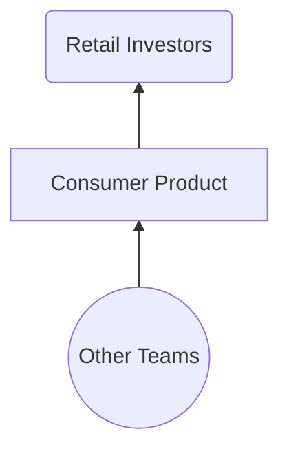
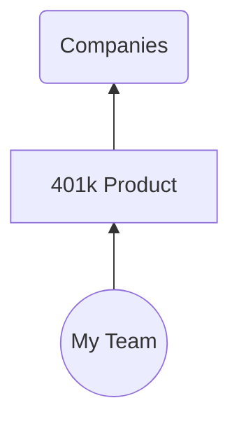
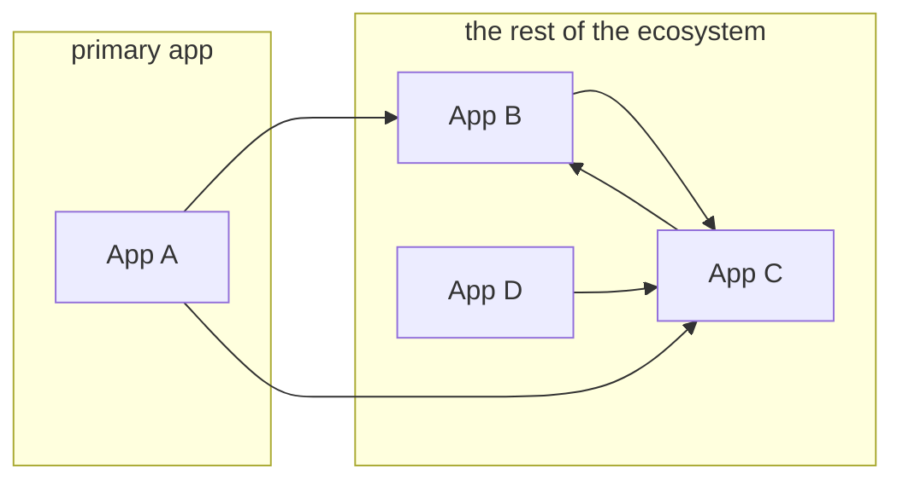
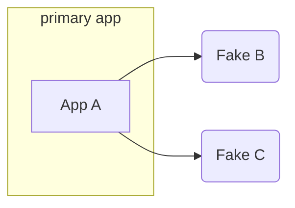
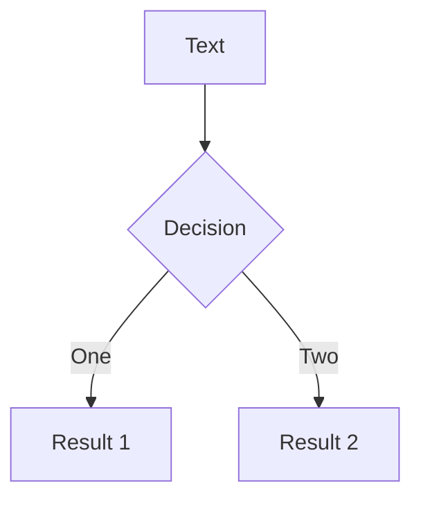

# **RAILS_ENV=demo**

#### unlocking the potential of the "demo" environment

<!--
Okay, so let's get started.

Hello. Welcome. I'm Nathan. I'm glad to be here.
A little nervous, too.

This is actually my first live conference talk.

I gave one last year, but it was prerecorded, so I spent like a week recording over and over trying to get the perfect take. Would definitely not recommend, so I'm more than happy to YOLO this one with you all today.
-->

---
layout: section
---

# RAILS_ENV=demo

<!--
Okay, so you might be here because you saw the title of this talk

RAILS_ENV=demo

and something about it intrigued you.

Or maybe you just picked a room at random. I don't know why you're here.

But either way, let's just unpack this title.
-->

---
layout: fact
---

## **RAILS_ENV=<ins>demo</ins>** bundle exec rails s

<!--
So, what it refers to is the environment variable used to control the mode that your Rails app boots up in.
-->

---
layout: fact
---

## **RAILS_ENV=<ins>development</ins>** bundle exec rails s

<!--
Now, by default, that's actually gonna be development.
-->

---
layout: fact
---

## **RAILS_ENV=<ins>test</ins>** bundle exec rails s

<!--
Or test if you're running your tests
-->

---
layout: fact
---

## **RAILS_ENV=<ins>production</ins>** bundle exec rails s

<!--
And you can toggle it to production, when you deploy your app somewhere.
-->

---
layout: fact
---

## **RAILS_ENV=<ins>staging</ins>** bundle exec rails s

<!--
Some teams might also have a staging environment.
-->

---
layout: fact
---

## ~~**RAILS_ENV=<ins>staging</ins>** bundle exec rails s~~

<!--
But that's actually not one of the built-ins.
-->

---
layout: fact
---

## RAILS_ENV={**development**, **production**, **test**}

<!--
Out of the box you get the big three: development, production, and test.
-->

---
layout: center
---

```bash
$ ls config/environments/

  development.rb
  production.rb
  test.rb
```

<style>
pre {
font-size: 200% !important;
line-height: 120% !important;
}
</style>

<!--
and these environments correspond to
files live in your config-slash-environments folder
-->

---
layout: center
---

### config/environments/production.rb

```ruby
Rails.application.configure do
  config.cache_classes = true
  config.eager_load = true

  config.consider_all_requests_local = false
  config.action_controller.perform_caching = true

  config.assets.compile = false

  config.log_level = :info
  config.log_tags = %i(request_id)

  # ...
end
```

<!--
And these files contain the actual *instructions* for how your app should behave in each environment.

Like, what makes that environment unique.

With me so far? Good.
-->

---
layout: fact
---

## RAILS_ENV={**demo**, development, test, production}

<!--
And so what I'm going to be talking about today is this idea of adding a new, dedicated environment -- called "demo" -- for giving, well, application demos.
-->

---
layout: image
image: /images/sales-pitch.jpg
---

<div style="position:absolute;right:10px;bottom:10px" class="text-xs text-opacity-100">
Photo by <a href="https://unsplash.com/@xteemu?utm_source=unsplash&utm_medium=referral&utm_content=creditCopyText">Teemu Paananen</a> on <a href="https://unsplash.com/s/photos/pitch?utm_source=unsplash&utm_medium=referral&utm_content=creditCopyText">Unsplash</a>
</div>

<!--
Like, the ability to step up in front of an audience, and show off a live version of your product.
Like, reliably. And repeatably. And consistently.

Because the last thing you want is to get up there, and for something to go wrong.
-->

---
layout: image
image: /images/showroom.jpg
---

<div style="position:absolute;right:10px;bottom:10px"  class="text-xs">
Photo by <a href="https://unsplash.com/@rahulbhogal?utm_source=unsplash&utm_medium=referral&utm_content=creditCopyText">Rahul Bhogal</a> on <a href="https://unsplash.com/s/photos/showroom?utm_source=unsplash&utm_medium=referral&utm_content=creditCopyText">Unsplash</a>
</div>

<!-- 
So think of this like the showroom model of your app.
-->

---
layout: image
image: /images/kiosk.jpg
class: bg-contain
style: 'background-size: contain'
---

<div class="text-xs" style="color:grey;position:absolute;right:10px;bottom:10px">
Source: <a href="https://www.reddit.com/r/n64/comments/bn3x7d/playing_demos_in_the_stores/">reddit.com</a>
</div>

<!--
or maybe the walmart gamecube kiosk version of your app.

except without the horrible neck strain.
-->

---
layout: center
---

```bash {3}
$ ls config/environments/

  demo.rb
  development.rb
  production.rb
  test.rb
```

<style>
pre {
font-size: 200% !important;
line-height: 120% !important;
}
</style>

<!--
And I wish I could say it were as simple as just adding a new
demo.rb file to your app, but that's just the tip of the iceberg.
-->

---
layout: image
image: /images/iceberg.jpg
class: text-center
---

<div class="mt-50 text-shadow-lg">

<h1 style="font-size:400%"><b>"demoability"</b></h1>

</div>

<!--
Because "demoability" -- the ability to quickly take something
you've been building, and show it off to the world -- is about
a lot more than just the way you boot up your app.

It's actually something I and my team have been thinking
about and iterating on for almost six years.

And so who am I?
-->

---
layout: image-left
image: /images/me.jpg
---

# Nathan Griffith

GitHub: <a href="https://github.com/smudge">@smudge</a><br/>
Twitter: <a href="https://twitter.com/smudgethefirst">@smudgethefirst</a><br/>
Homepage: <a href="https://ngriffith.com">ngriffith.com</a>

<!--
Well, let me introduce myself.

My name is Nathan. I exist online in a few places.

I also exist in real life, and I work at a company called Betterment.
-->

---
layout: center
---


<!--
You might've heard of us. We offer financial advice, investing accounts, checking,
retirement, you name it.
I like to say that our top product is financial peace of mind.

And I work on the application platform teams at Betterment.
We focus on a lot of cross-cutting concerns, and we
provide our product teams with more of a day-to-day peace of mind.

But I haven't always worked on this team.
-->

---
layout: section
---

# 2016

<!--
Now, the story I want to tell starts in 2016, when I first joined Betterment.
-->

---
layout: fact
---

## 401(k)

<!--
Back then, I was on a different team, helping build Betterment's 401k offering,
now known as Betterment @ Work.
-->

---
layout: two-cols
class: px-40
---

::right::




<!--
And so while most people think of Betterment as a B2C business.
Like, financial services for everyday people like me and my parents.
(The industry calls them "retail investors")
-->

---
layout: two-cols
class: px-40
---



::right::


<!--

The thing my team was building was actually a B2B product.
Because our customers were companies, who might want to offer 401k plans to their employees.
-->

---

# "sales"

<!--
And, look, I'm not on the business side of things.
I'm just a humble software engineer,

But if there's one thing I know about B2B businesses,
it's that they do a lot of product demos.

And so we found ourselves in a position where, we 
really wanted to SHOW OFF Betterment's consumer product
to all of our new and prospective business clients.
-->

---

# "staging"

<!--
And so how did we do that?
Well, we looked around and saw that Betterment
already had a Staging environment.

It was basically a replica of production, except
the database was reset and repopulated nightly with some magical sanitized data instead of real production data.

And we said, hey, what if we just did something like that?
-->

---

# owl

<!--
and if this sounds a bit like

"step 1, draw circles, step 2, draw the owl"

it's because that's exactly what this is.
you see, if what you need is a drawing of an owl,
and someone else is already drawing owls,
then you don't really need to learn to draw the owl.

And so, the staging environment was our owl.
-->

---

# owl with hat

<!--
Of course, we made a couple modifications to the owl. We
didn't need or even want all of the sanitized staging data, so
we added another process that would pick out just the demo
accounts we needed and keep those around.
-->

---

# copy-paste

<!--
But as for the rest of it, we just copy-pasted the deployment
scripts, the environment file, everything that made staging...
staging. And we deployed it, 
-->

---

# Success!

<!--
and it worked! so, our work was done, right?

well that's what we thought.
-->

---

# 2017

<!--
But fast forward a bit, and by 2017 the cracks
were starting to show.
-->

---

## Busy working

<!--
We were still hard at work on our roadmap.
Improving existing features and building out new functionality like payroll integrations.
-->

---

## images of slack conversations

<!--
And while we were hard at work.
We started to get a sense that the demo environment wasn't
really all that reliable.

And, you know, anytime this happened, we could drop
what we were doing and fix it. But it was always a choice between
that and the roadmap.

Plus, everytime it broke,
it got a little bit harder to fix. Like an old
car that you keep patching up until eventually it's held
together by duck tape and sheer force of will.

and eventually, one morning, when you turn the key to start the ignition,
-->

---

## image of broken builds

<!--
nothing happens.

that's where we ended up. and so we effectively gave up. And it felt bad.

By the way, we don't use Jenkins anymore, but I saved this image of our Jenkins builds,
and if you look closely, it's actually an entire year's
worth of broken builds.

Each one of those was a developer, banging their head against their keyboard, trying to get this working.
-->

---

# 2019

<!--
So fast forward again, and by 2019, the business need
had caught up with us, again. We really needed this thing
to be working. Like, we had been making do with other ways of demoing our product, but we really needed a reliable and repeatable demo experience. Again, "demoability."

And so, this time, our team was bigger, and we were in a great position to add it to the roadmap.
This was no longer just a passion project for our team.
-->

---

# retro

<!--
And so the first thing we did was do a bit of an incident
response meeting -- you know, a root cause analysis -- to try to understand firstly, how
everything had even worked, and in turn, what
decisions and assumptions had resulted in it ultimately
breaking down.

real systems thinking
-->

---
layout: center
---

<div class="grid grid-cols-3">


<div>

# &nbsp;

## **Apps/Services:**
## **User Accounts:**
## **Database:**
## **Cadence:**
## **Ownership:**

</div><div>

# Demo v1:

<v-clicks>

## all of them  
## fixtures/seeds  
## periodically reset  
## push button (and 🤞)  
## single team  

</v-clicks>

</div>
</div>

<!--
And so here's what we came up with.

- Firstly, it was deployed as a "complete" environment.
So we run a **bunch** of apps at betterment, and when we deployed the demo env, we had to deploy every one of those, so that they could talk to each other, and function. They even connected to things like third party sandbox servers.
- Next, it relied on having a set of pre-populated, "known" accounts. So, basically, fixture or seed data. And there are a lot of different ways to produce this.
- Then, to keep those user accounts fresh, we would periodically wipe the database and reset this data. 
- And at first, all of this was deployed weekly (on Sundays), but then when that got too painful, we switched it to monthly, but that got even _more_ painful, so we started only deploying when we needed to update it to demo newer features or designs. So, let's call this "push button" deploys (but it was really "push button and cross fingers").
- Lastly, it was maintained solely by, well, us. The engineering team closest to the need for its existence (and most incentivized to do the work)

So we had this list of choices we'd made (both intended and unintended), and so then we started to ask ourselves,
what can we choose instead?
-->

---
layout: center
---

<div class="grid grid-cols-3">


<div>

# &nbsp;

## **Apps/Services:**
## **User Accounts:**
## **Database:**
## **Cadence:**
## **Ownership:**

</div><div>

# Demo v1:

## ~~all of them~~  
## fixtures/seeds  
## periodically reset  
## push button (and 🤞)  
## single team  

</div><div>

# Demo v2:

## ???

</div>
</div>

<!--

Like, if we wanna cross some of these things out, and try something else,
what are the alternatives?

And so, firstly, we thought, what if instead of deploying an
entire cluster of services, we deploy just a single,
standalone app.

Now, the more cross-dependencies you have, the harder
this might be to do, but in our case, we actually already
had a way of doing this.
-->

---

# ~~staging~~ -> **development**

<!--
Instead of basing this off of our _staging_ environment,
We just had to look to the way our **development** environments
worked.

Because we could already run these apps in isolation
on our laptops, when developing them.
-->

---
layout: two-cols
class: text-center
---


# Without Fakes:

<v-click>




</v-click>

::right::


# With Fakes:

<v-click>



</v-click>

---

# How?

- Webmock
- WebValve

---

# WebValve

```ruby
class FakeBank < WebValve::FakeService
  get '/widgets' do
    json result: 'it works!'
  end
end
```

---

# "Stateful" Fakes

- Real database models, fake data

---


---
layout: image-right
image: https://source.unsplash.com/collection/94734566/1920x1080
---

# Code

---

# Components

---
class: px-40
---

# Two Columns

This is me, **testing a two col approach**

<div grid="~ cols-2 gap-2" m="-t-2">

```yaml
---
theme: default
---
```

```yaml
---
theme: seriph
---
```

# Test1

# Test2

<div>

- list 1
- yay
- boo

</div>

<div>

- list2
- boo
- yay

</div>

</div>

---
layout: center
class: text-center
---

<div class="grid grid-cols-3">

<div></div>



<div></div>

</div>


---
layout: center
class: text-center
---

# Learn More

[Documentations](https://sli.dev) · [GitHub](https://github.com/slidevjs/slidev) · [Showcases](https://sli.dev/showcases.html)
