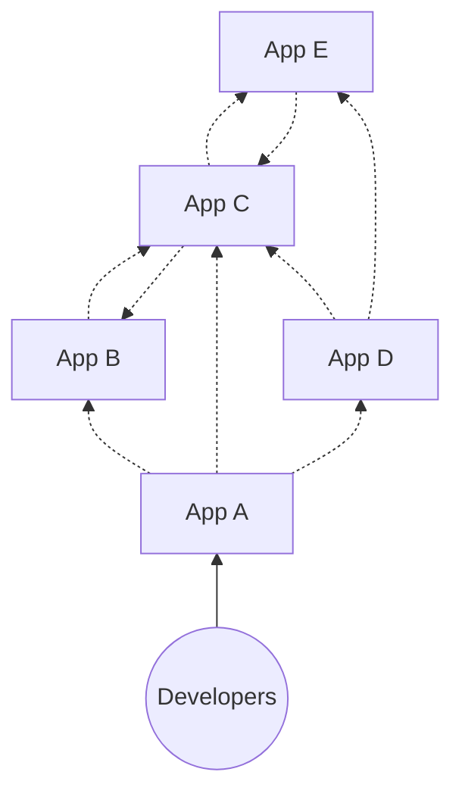
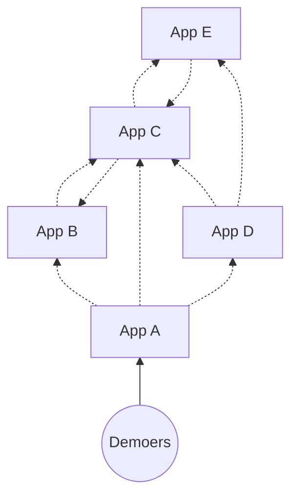
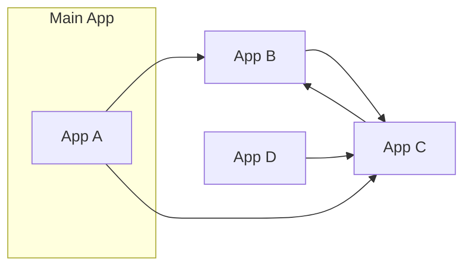
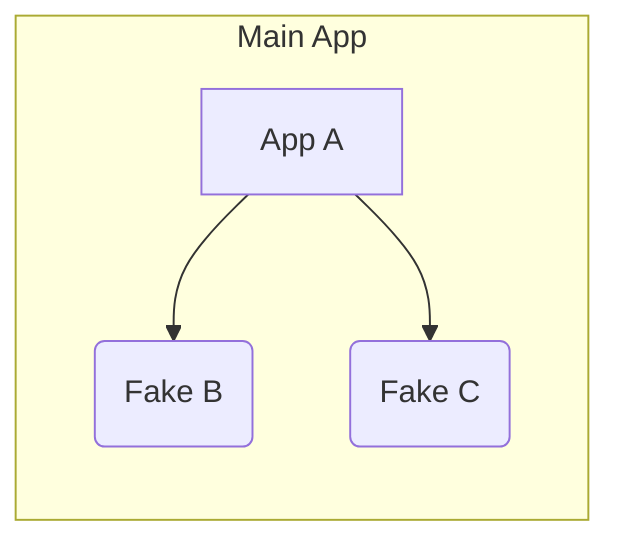
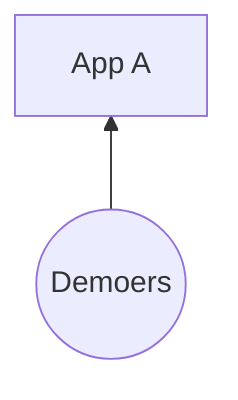
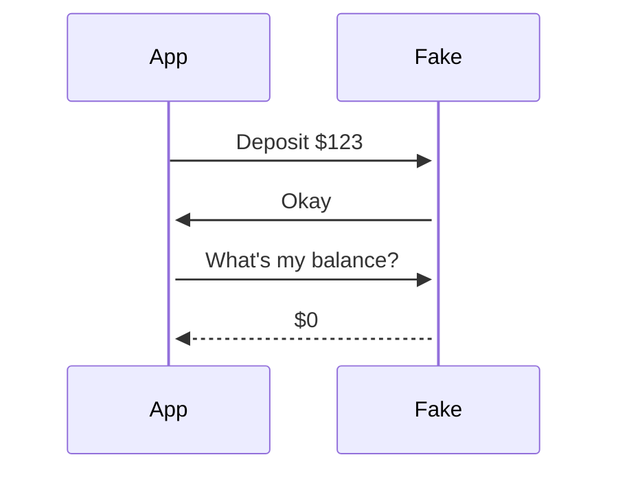
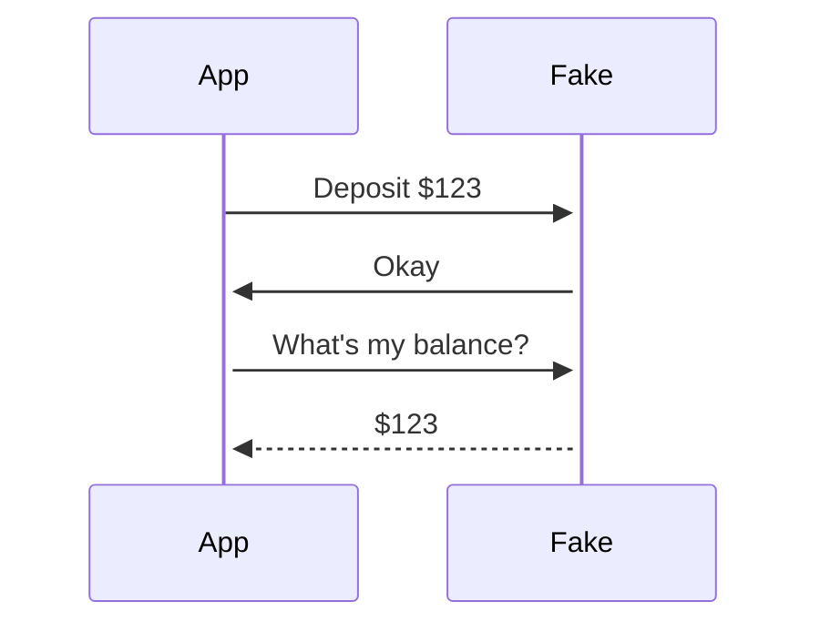
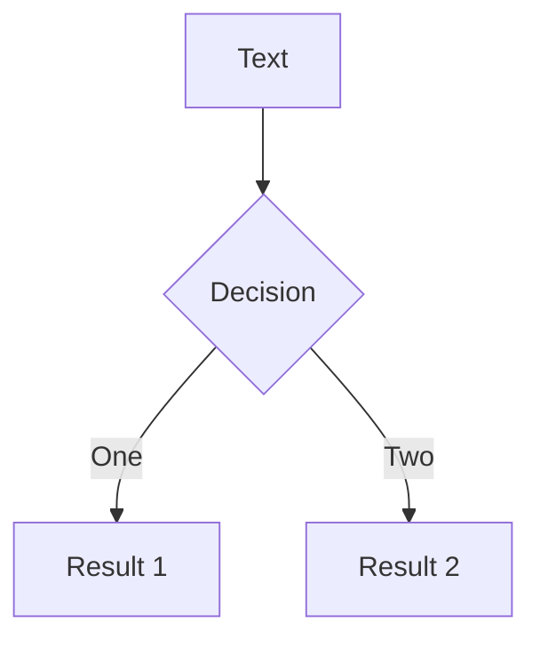

# **RAILS_ENV=demo**

#### unlocking the potential of the "demo" environment

<!--
Okay, so let's get started.

Hello. Welcome. I'm Nathan. I'm glad to be here.
A little nervous, too.

This is actually my first live conference talk.

I gave one last year, but it was prerecorded, so I spent like a week recording over and over trying to get the perfect take. Would definitely not recommend, so I'm more than happy to YOLO this one with you all today.
-->

---
layout: section
---

# RAILS_ENV=demo

<!--
Okay, so you might be here because you saw the title of this talk

RAILS_ENV=demo

and something about it intrigued you.

Or maybe you just picked a room at random. I don't know why you're here.

But either way, let's just unpack this title.
-->

---
layout: fact
---

## **RAILS_ENV=<ins>demo</ins>** bundle exec rails s

<!--
So, what it refers to is the environment variable used to control the mode that your Rails app boots up in.
-->

---
layout: fact
---

## **RAILS_ENV=<ins>development</ins>** bundle exec rails s

<!--
Now, by default, that's actually gonna be development.
-->

---
layout: fact
---

## **RAILS_ENV=<ins>test</ins>** bundle exec rails s

<!--
Or test if you're running your tests
-->

---
layout: fact
---

## **RAILS_ENV=<ins>production</ins>** bundle exec rails s

<!--
And you can toggle it to production, when you deploy your app somewhere.
-->

---
layout: fact
---

## **RAILS_ENV=<ins>staging</ins>** bundle exec rails s

<!--
Some teams might also have a staging environment.
-->

---
layout: fact
---

## ~~**RAILS_ENV=<ins>staging</ins>** bundle exec rails s~~

<!--
But that's actually not one of the built-ins.
-->

---
layout: fact
---

## RAILS_ENV={**development**, **production**, **test**}

<!--
Out of the box you get the big three: development, production, and test.
-->

---
layout: center
---

```bash
$ ls config/environments/

  development.rb
  production.rb
  test.rb
```

<style>
pre {
font-size: 200% !important;
line-height: 120% !important;
}
</style>

<!--
and these environments correspond to
files live in your config-slash-environments folder
-->

---
layout: center
---

### config/environments/production.rb

```ruby
Rails.application.configure do
  config.cache_classes = true
  config.eager_load = true

  config.consider_all_requests_local = false
  config.action_controller.perform_caching = true

  config.assets.compile = false

  config.log_level = :info
  config.log_tags = %i(request_id)

  # ...
end
```

<!--
And these files contain the actual *instructions* for how your app should behave in each environment.

Like, what makes that environment unique.

With me so far? Good.
-->

---
layout: fact
---

## RAILS_ENV={**demo**, development, test, production}

<!--
And so what I'm going to be talking about today is this idea of adding a new, dedicated environment -- called "demo" -- for giving, well, application demos.
-->

---
layout: image
image: /images/sales-pitch.jpg
---

<div style="position:absolute;right:10px;bottom:10px" class="text-xs">
Photo by <a href="https://unsplash.com/@xteemu?utm_source=unsplash&utm_medium=referral&utm_content=creditCopyText">Teemu Paananen</a> on <a href="https://unsplash.com/s/photos/pitch?utm_source=unsplash&utm_medium=referral&utm_content=creditCopyText">Unsplash</a>
</div>

<!--
Like, the ability to step up in front of an audience, and show off a live version of your product.
Like, reliably. And repeatably. And consistently.

Because the last thing you want is to get up there, and for something to go horribly wrong, or even a little wrong.
-->

---
layout: image
image: /images/showroom.jpg
---

<div style="position:absolute;right:10px;bottom:10px"  class="text-xs">
Photo by <a href="https://unsplash.com/@rahulbhogal?utm_source=unsplash&utm_medium=referral&utm_content=creditCopyText">Rahul Bhogal</a> on <a href="https://unsplash.com/s/photos/showroom?utm_source=unsplash&utm_medium=referral&utm_content=creditCopyText">Unsplash</a>
</div>

<!-- 
So think of this like the showroom model of your app.
-->

---
layout: image
image: /images/kiosk.jpg
class: bg-contain
style: 'background-size: contain'
---

<div class="text-xs" style="color:grey;position:absolute;right:10px;bottom:10px">
Source: <a href="https://www.reddit.com/r/n64/comments/bn3x7d/playing_demos_in_the_stores/">reddit.com</a>
</div>

<!--
or maybe the walmart gamecube kiosk version of your app.

except without the horrible neck strain.
-->

---
layout: center
---

```bash {3}
$ ls config/environments/

  demo.rb
  development.rb
  production.rb
  test.rb
```

<style>
pre {
font-size: 200% !important;
line-height: 120% !important;
}
</style>

<!--
And I wish I could say it were as simple as just adding a new
demo.rb file to your app, but that's just the tip of the iceberg.
-->

---
layout: image
image: /images/iceberg.jpg
class: text-center
---

<div class="mt-50 text-shadow-lg">

<h1 style="font-size:400%"><b>"demoability"</b></h1>

</div>

<!--
Because "demoability" -- the ability to quickly take something
you've been building, and show it off to the world -- is about
a lot more than just the way you boot up your app.

It's actually something I and my team have been thinking
about and iterating on for almost six years.

And so who am I?
-->

---
layout: image-left
image: /images/me.jpg
---

# Nathan Griffith

GitHub: <a href="https://github.com/smudge">@smudge</a><br/>
Twitter: <a href="https://twitter.com/smudgethefirst">@smudgethefirst</a><br/>
Homepage: <a href="https://ngriffith.com">ngriffith.com</a>

<!--
Well, let me introduce myself.

My name is Nathan. I exist online in a few places.

I also exist in real life, and I work at a company called Betterment.
-->

---
layout: center
class: px-40
---


<!--
You might've heard of us. We offer financial advice, investing accounts,
retirement, you name it.
I like to say that our top product is financial peace of mind.

And I work on the application platform teams at Betterment.
We focus on a lot of cross-cutting concerns, and we
provide our product teams with more of a day-to-day peace of mind.

But I haven't always worked on this team.
-->

---
layout: image
image: /images/2016.svg
---
# &nbsp;

<!--
Now, the story I want to tell starts in 2016, when I first joined Betterment.
-->

---
layout: center
class: px-30
---


<!--
Back then, I was on a different team, helping build Betterment's 401k offering,
which is now part of Betterment @ Work.
-->

---
layout: image
image: /images/sales-b2c.svg
---

# &nbsp;


<!--
And so while most people think of Betterment as a B2C business.
Like, financial services for everyday people like me and my parents.
-->

---
layout: image
image: /images/sales-b2b.svg
---

# &nbsp;

<!--

The thing my team was building was actually a B2B product.
Because our customers were companies, who might want to offer 401k plans to their employees.

And, look, I'm not on the business side of things.
I'm just a humble software engineer,

But if there's one thing I know about B2B businesses,
it's that they do a lot of product demos.
-->

---
layout: image
image: /images/sales-b2c2b.svg
---

# &nbsp;

<!--

And so we found ourselves in a position where, we 
really wanted to SHOW OFF Betterment's consumer product
to all of our new and prospective business clients.

And so how did we do that?
-->

---
layout: two-cols
class: text-center px-30
---

# production


::right::

<v-click>

# "staging"



</v-click>

<!--
So, firstly, there's always the option to just use the production app, right? And in our case, it's a cluster of multiple applications.
But since our app involves real money, and real personal info, that option didn't feel great.

But we looked around and saw that Betterment also had a _staging_ environment.

CLICK

It was deployed in exactly the same overall configuration as production, except
the database was reset and repopulated nightly with some magical sanitized data instead of real production data.

And we said, hey, what if we just did something like that?
-->

---
layout: center
---


<!--
and if this sounds a bit like

"step 1, draw circles, step 2, draw the owl"

it's because that's exactly what this is.
you see, if what you need is a drawing of an owl,
and someone else is already drawing owls,
then you don't really need to learn to draw the owl.
-->

---
layout: two-cols
class: text-center px-30
---

# staging


::right::

<v-click>

# demo

<div class="relative mt-15">


</div>

</v-click>

<!--
And so, the staging environment was our owl.

Of course, we made a couple modifications to the owl. We
didn't need or even want all of the sanitized staging data, so
we added another process that would pick out just the demo
accounts we needed and keep those around.
-->

---
layout: two-cols
class: text-center px-30
---

# staging


::right::

# demo



<!--
But as for the rest of it, we just copy-pasted the deployment
scripts, the environment file, everything that made staging...
staging. And we deployed it, 
-->

---
layout: image
image: /images/reenactment.jpg
---

<div style="position:absolute;right:10px;bottom:10px"  class="text-xs">
Photo by <a href="https://unsplash.com/@xteemu?utm_source=unsplash&utm_medium=referral&utm_content=creditCopyText">Teemu Paananen</a> on <a href="https://unsplash.com/s/photos/pitch?utm_source=unsplash&utm_medium=referral&utm_content=creditCopyText">Unsplash</a>
</div>

<!--
and it worked! so, our work was done, right?

well that's what we thought.
-->

---
layout: image
image: /images/2017.svg
---

# &nbsp;

<!--
But fast forward a bit, to 2017.
-->

---
layout: image
image: /images/roadmap.jpg
---

<div style="position:absolute;right:10px;bottom:10px"  class="text-xs">
Photo by <a href="https://unsplash.com/@airfocus?utm_source=unsplash&utm_medium=referral&utm_content=creditCopyText">airfocus</a> on <a href="https://unsplash.com/s/photos/roadmap?utm_source=unsplash&utm_medium=referral&utm_content=creditCopyText">Unsplash</a>
</div>  

<!--

We were still hard at work on our roadmap.
-->

---
layout: center
---


<v-clicks>


</v-clicks>

<!--
But we were getting a sense that the demo environment wasn't really all that reliable.

And, you know, anytime this happened, we could drop
what we were doing and fix it. But it was always a choice between
that and the roadmap.

Plus, everytime it broke,
it got a little bit harder to fix. Like an old
car that you keep patching up until eventually it's held
together by duck tape and sheer force of will.

and eventually, one morning, when you turn the key to start the ignition,
-->

---
layout: center
---


<!--
nothing happens.
-->

---
layout: center
class: pt-20
---


<!--

that's where we ended up. and so we effectively gave up. And it felt bad.

By the way, we don't use Jenkins anymore, but I saved this screengrab of our build history,
and if you look closely, it's actually an entire year's worth of broken builds.

Each one of those was a developer, banging their head against their keyboard, trying to get this working.
-->

---
layout: image
image: /images/2019.svg
---

# &nbsp;

<!--
So fast forward again, and by 2019, the business needs had caught up with us
again. We really needed this thing to be working.

But we also had time in our roadmap finally.
-->

---
layout: image
image: /images/iceberg.jpg
---

<div class="ml-50 mt-30 text-3xl text-shadow-lg font-bold">

<v-clicks>

- What was deployed?
- How frequently was it deployed?
- Where did the data come from?
- How did you log in?
- Who owned it?

</v-clicks>

</div>

<!--
And so the first thing we did was a bit of a retrospective deep dive, to try to
understand firstly, how everything had even worked, and in turn, what decisions
and assumptions had resulted in it ultimately breaking down.

And so we asked ourselves questions like:
- What got deployed
- And how frequently?
- How did the database work?
- How did you log in?
- And, most importantly, whose job was it to maintain this thing?
-->

---
layout: center
---

<div class="grid grid-cols-3">


<div>

# &nbsp;

## **Deployed:**
## **Data:**
## **Cadence:**
## **Ownership:**

</div><div class="pr-10">

# Demo v1:

<v-clicks>

## everything
## fixtures/seeds
## push button (🤞)
## single team

</v-clicks>

</div>
</div>

<!--
And this helped us trace things back to 4 major architectural decisions.

Firstly, what got deployed? Well, everything. All of our apps.

Secondly, the database was populated up front with all of the demo accounts,
and this got reset with every deployment.

And at first, all of this was deployed weekly (on Sundays), and then Monthly,
but when even that got to be too painful, we started only deploying when we
needed to. So it was "push button" deploys, but I'd call it"push button and
cross fingers"

Lastly, who maintained it? Well, us. The engineering team closest to the need
for its existence (and most incentivized to do the work).

And so, now that we had this list, we started crossing things out.
-->

---
layout: center
---

<div class="grid grid-cols-3">


<div>

# &nbsp;

## **Deployed:**
## **Data:**
## **Cadence:**
## **Ownership:**

</div><div class="pr-10">

# Demo v1:

## ~~everything~~
## fixtures/seeds
## push button (🤞)
## single team

</div><div>

# Demo v2:

## ???

</div>
</div>

<!--
First, we thought, what if instead of deploying an
entire cluster of services, we deploy just the one app that we want to demo, running in some kind of standalone mode.

And the benefits there should be obvious right? From a maintainability standpoint, why manage all of this
if we could just manage this.

And that got us thinking, because at Betterment we already have a way of running our Rails apps in isolation.
-->

---
layout: image
image: /images/dev-laptop.jpg
---

<div style="position:absolute;right:10px;bottom:10px" class="text-xs">
Photo by <a href="https://unsplash.com/@cgower?utm_source=unsplash&utm_medium=referral&utm_content=creditCopyText">Christopher Gower</a> on <a href="https://unsplash.com/s/photos/laptop-office?utm_source=unsplash&utm_medium=referral&utm_content=creditCopyText">Unsplash</a>
</div>


<!--

It's how we run them on our development laptops!

And so when we develop apps locally, we use a tool called...
-->

---
layout: center
---


<!--
...webvalve.

what webvalve lets us do is define fake versions of any external service or app,
and it will automatically route all web traffic to the fakes,
-->

---
layout: two-cols
class: text-center
---


# Without WebValve:

<v-click>




</v-click>

::right::


# With WebValve:

<v-click>



</v-click>

<!--
and so instead of running an entire cluster of applications locally,
we have a set of fakes which actually run _inside_ of the Rails app itself.

So it's all one Rails process.
-->

---

# WebValve

```ruby
class FakeBank < WebValve::FakeService
  get '/widgets' do
    json result: {
      value: 9.99,
      message: 'it works!'
    }
  end
end
```

<!--
And these fakes apps are really simple.

They don't have to do everything the real app would do,
they just have to respond with some fake data, so that your app doesn't break.
-->

---
layout: center
---


<!--
Now, there's a whole other talk on how useful WebValve can be for local development
and testing.
-->

---
layout: center
---


<!--
Our VP of Architecture, Sam Moore, does a great job summarizing,
and so I'm not gonna cover it here.
-->

---
layout: center
class: px-50
---

<center><h2>github.com/Betterment/webvalve</h2></center>


<!--
and you can find that and more in the webvalve README
-->

---
layout: two-cols
class: text-center px-30
---

# Before


::right::

# After

<v-click>

<div class="mt-50 pl-10">



</div>


</v-click>

<!--
But what I will cover is how we got it working for demos.

And, so, firstly,

CLICK

it did allow us to actually deploy just a single app, basically for free.

Because it used all of the fake services that our teams had _already_ written.
-->

---
layout: center
class: px-40 bg-blue-100
---


<!--
And so this was great!

I showed one of my colleagues who commonly gave client demos, and he clicked
around, and he liked what he was seeing.

But then he encountered...
-->

---
layout: center
class: px-20 bg-blue-100
---


<!--
...this page, which is supposed to graph he performance history of an account.

And he said, hold on, I can't show this to a client.
-->

---
layout: center
class: px-20 bg-blue-100
---


<!--
And I was like, well we don't actually have any performance history, because
this is just a demo app, and the history comes from a different backend
service, and blah blah blah, developer talk.

And he said, doesn't matter. If a client has to ask why something looks broken,
then the demo is already off track.
-->

---
layout: center
class: px-40
---


<div style="position:absolute;right:10px;bottom:10px;color: #ddd" class="text-xs">
Arrested Development (TV Series 2003-2019)
</div>


<!--
So I walked away from that meeting feeling a little bummed, because he was
right, and I knew I was just making excuses for technical shortcomings.

And, so I started to wonder if this was even the right approach.
-->

---


<div grid="~ cols-2 gap-5" m="-t-2"><div>

```ruby
class FakeBalanceService < WebValve::FakeService
  get '/api/daily_returns' do
    json([
      {
        date: Date.yesterday.to_s(:iso8601),
        balance_cents: 1_000_00,
        starting_balance_cents: 1_000_00,
        market_change_amount_cents: 0,
        dividend_amount_cents: 0,
        fees_cents: 0
      }
    ])
  end
end
```

</div>
<div><div class="bg-blue-100 px-5 pt-2 pb-2 absolute top-0 bottom-0">


</div></div></div>


<!--
But I thought about it more. Because, like, most of the application worked
as intended. It was just some of these external service boundaries that didn't
make for a good demo.

And so, I thought, why not, just, make the fake service a little more fake.
-->

---


<div grid="~ cols-2 gap-5" m="-t-2"><div>

```ruby {all|7|8|9|10|11|all}
class FakeBalanceService < WebValve::FakeService
  get '/api/daily_returns' do
    date_range = dates(params[:from], params[:to])
    balance = Money.new(1_000_00)
    json(date_range.map.with_index do |date, idx|
      starting_balance = balance
      buys = deposit?(date) ? random_buy : 0
      sells = withdraw?(date) ? random_sell : 0
      mkt_changes = balance * random_market_change
      divs = dividend?(date) ? balance * 0.01 : 0
      fees = fee?(date) ? balance * 0.0025 : 0
      balance += buys - sells + mkt_changes + divs - fees
      {
        date: date.to_s(:iso8601),
        balance_cents: balance.cents,
        starting_balance_cents: starting_balance.cents,
        market_change_amount_cents: mkt_changes.cents,
        dividend_amount_cents: divs.cents,
        fees_cents: fees.cents,
      }
    end)
  end
end
```

</div>
<div><div class="bg-blue-100 px-5 pt-2 pb-2 absolute top-0 bottom-0" v-click-hide>


</div>

<div class="bg-blue-100 px-5 pt-2 pb-2 absolute top-0 bottom-0" v-after>


</div></div></div>


<!--
And so, I wrote a fake stock market simulation.
With buys, and sells, and market changes, and dividends, and fees.

CLICK

And of course, none of this is actually based in any kind of reality.
Like, this is a terrible simulation.
But it resulted in

CLICK

this graph.

Again, is this real? No, absolutely not. But is it demoable? Maybe.
-->

---
layout: center
class: px-20 bg-blue-100
---


<!--
So I went back to my colleague, and he said, yeah, sure, looks fine, and, so at
that point I decided, okay, we can probably run with this.

But there was one more issue.
-->

---
layout: center
class: px-20
---


<div style="position:absolute;right:10px;bottom:10px;color: #ddd" class="text-xs">
Finding Nemo (2003)
</div>


<!--
These fake services had no ability to remember anything.

And by that I mean, if you performed an action...
-->

---
layout: center
class: px-20
---



<!--
Like make a deposit, which resulted in an external POST request.
The next time you fetched your balance, via an external GET request.
It would show your previous balance.

So again, that was gonna break the immersion.
-->

---
layout: center
---

# **"Stateful" Fakes**

<!--
And this is where we came up with the idea of stateful fakes
-->

---
layout: center
---

```ruby {all|2-5|6-11|19}
class FakeBalanceService < WebValve::FakeService
  class FakeAccount < ActiveRecord::Base
    money :balance
  end

  get '/api/balance' do
    fake_account = FakeAccount
      .find_by(account_id: params[:account_id])

    json balance_cents: fake_account&.balance.cents || 0
  end

  post '/api/deposit' do
    fake_account = FakeAccount
      .where(account_id: params[:account_id)
      .first_or_create!(balance_cents: 0)

    deposit = params[:amount_cents].to_money
    fake_account.update!(balance: fake_account.balance + deposit)

    json balance_cents: fake_account.balance.cents
end
```


<!--
A stateful fake is a WebValve fake, that can remember things.

CLICK

It gets its own database tables and ActiveRecord models.

CLICK

And it can read from those tables during GET requests

CLICK

And actually UPDATE those tables during POST/PUT/PATCH/DELETE/etc
-->

---
layout: center
class: px-20
---




<!--
And so now it can remember things!
-->

---

# Recap

- We enabled WebValve
- We made the fake responses not just fake, but demoable
- And we gave fakes the ability to remember things

---

<div class="grid grid-cols-3">


<div>

# &nbsp;

## **Deployed:**
## **Data:**
## **Cadence:**
## **Ownership:**

</div><div class="pr-10">

# Demo v1:

## ~~everything~~
## fixtures/seeds
## push button (🤞)
## single team

</div><div>

# Demo v2:

<v-click>

## one! (+stateful fakes)

</v-click>

</div>
</div>

<!--
And so we had reduced our demo env from deploying EVERYTHING, to

CLICK

deploying just one app.


So next we focused our attention on the user accounts.
How the accounts got added to the demo database, and how to access them.
-->

---

<!--
And so if you remember, we relied on this kind of magic process that would
tear down and recreate the database every so often.

And when it did, you'd freshly-baked little demo accounts that you
could log in as, if you knew their email and password.
-->


<!--
and for that, we started with the most painful part of the process:

the cycle of refreshing and resetting the database.

Not only was this a common cause of build failure, it also wasn't
always reliably in sync with the state of the code.

Like, we were extracting certain test accounts from our staging environment,
but there was no rule that said the expected staging and demo database schemas
had to be in sync.
-->

---

<!--
And so ideally we'd do away with that entirely, and let the demo apps manage their
own data.
-->

---

<!--
Now, one option there, was to use Rails' built-in seeds.rb feature.
And we use this locally to seed our developer laptops with a bunch of test users.

But this still doesn't solve one other thing, which is that,
if I logged into one of these users, and signed up for, like, a Roth IRA,
that user then had a Roth IRA. And so if I need to repeat that demo again,
I already have a Roth IRA.

And we saw a lot of that, where these demo accounts would sort of get into 
these unusable states, and they wouldn't be reset until the next big data refresh.

And on top of that, there was nothing stopping two people from using the same demo account,
and that could also cause us to stomp on our own toes.
-->

---

<!--
So instead, we thought, well what if we generate a new user account, each time you log in.
So you'd always start with a blank slate.

And again, when we looked to our local development environments we saw that we already had
a way of doing this.

Factories! So we use a tool called FactoryBot. And we thought, well, what if we just call
FactoryBot.create(:user), and then log in as that user.
-->

---

<!--
And instead of a login form, all we would need was a single sign in button.
-->

---
layout: image-right
image: https://source.unsplash.com/collection/94734566/1920x1080
---

# Code

---

# Components

---
class: px-40
---

# Two Columns

This is me, **testing a two col approach**

<div grid="~ cols-2 gap-2" m="-t-2">

```yaml
---
theme: default
---
```

```yaml
---
theme: seriph
---
```

# Test1

# Test2

<div>

- list 1
- yay
- boo

</div>

<div>

- list2
- boo
- yay

</div>

</div>

---
layout: center
class: text-center
---

<div class="grid grid-cols-3">

<div></div>



<div></div>

</div>


---
layout: center
class: text-center
---

# Learn More

[Documentations](https://sli.dev) · [GitHub](https://github.com/slidevjs/slidev) · [Showcases](https://sli.dev/showcases.html)
