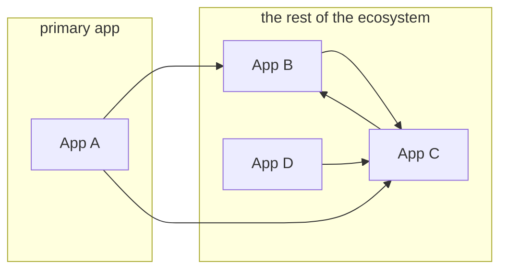
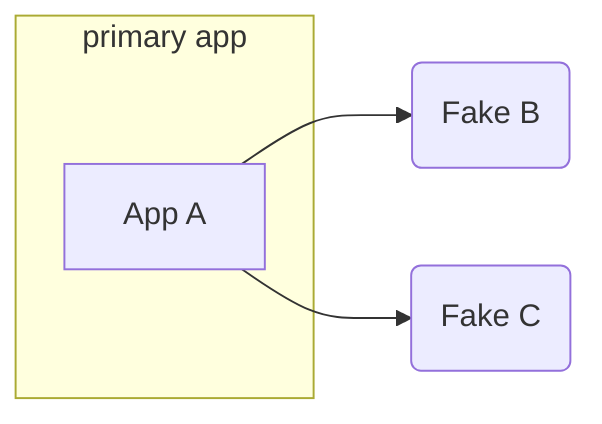
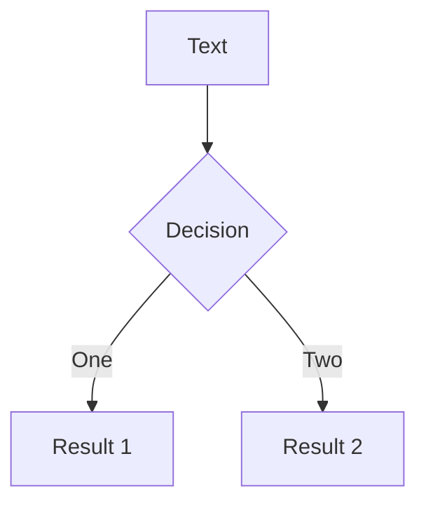

# RAILS_ENV=demo

#### Unlocking the potential of the "demo" environment

<!--
Hello. Welcome. I'm glad to be here.
-->

---
layout: image-left
image: /images/me.jpg
---

# Nathan Griffith

GitHub: <a href="https://github.com/smudge">@smudge</a><br/>
Twitter: <a href="https://twitter.com/smudgethefirst">@smudgethefirst</a><br/>
Homepage: <a href="https://ngriffith.com">ngriffith.com</a>

<!--
Quick intro: My name is Nathan. I can be found online.
-->

---

# framing the problem
- making a sufficiently complex application "demoable"

---

# anecdotal example

<!--
I’ll describe the painful experience of maintaining a demo deployment that constantly broke, leading to a complete overhaul and a bunch of lessons along the way
-->

---

# Demo v1

<v-clicks>

- A complete service ecosystem
- Pre-seeded user accounts
- Infrequent deployments
- Managed by a specific team

</v-clicks>

<!--
…was deployed as a "complete" environment (alongside "demo"/sandbox instances of all external services and collaborators).
…relied on having pre-seeded, "known" accounts (which could be generated by fixtures or by sanitizing staging/production data), and was periodically wiped clean and reset.
…was deployed only weekly, then monthly, and then via "push button" (perhaps better described as "push button and cross fingers").
…was maintained solely by the team closest to the need for its existence (the team incentivized to do the work).
-->

---
layout: two-cols
---
# Demo v1

- ~~A complete service ecosystem~~
- Pre-seeded user accounts
- Infrequent deployments
- Managed by a specific team

::right::

# Demo v2

- A standalone Rails app with **Stateful Fakes**

---
layout: two-cols
class: text-center
---


# Without Fakes:

<v-click>




</v-click>

::right::


# With Fakes:

<v-click>



</v-click>

---
layout: image-right
image: https://source.unsplash.com/collection/94734566/1920x1080
---

# Code

---

# Components

---
class: px-40
---

# Two Columns

This is me, **testing a two col approach**

<div grid="~ cols-2 gap-2" m="-t-2">

```yaml
---
theme: default
---
```

```yaml
---
theme: seriph
---
```

# Test1

# Test2

<div>

- list 1
- yay
- boo

</div>

<div>

- list2
- boo
- yay

</div>

</div>

---
layout: center
class: text-center
---

<div class="grid grid-cols-3">

<div></div>



<div></div>

</div>


---
layout: center
class: text-center
---

# Learn More

[Documentations](https://sli.dev) · [GitHub](https://github.com/slidevjs/slidev) · [Showcases](https://sli.dev/showcases.html)
