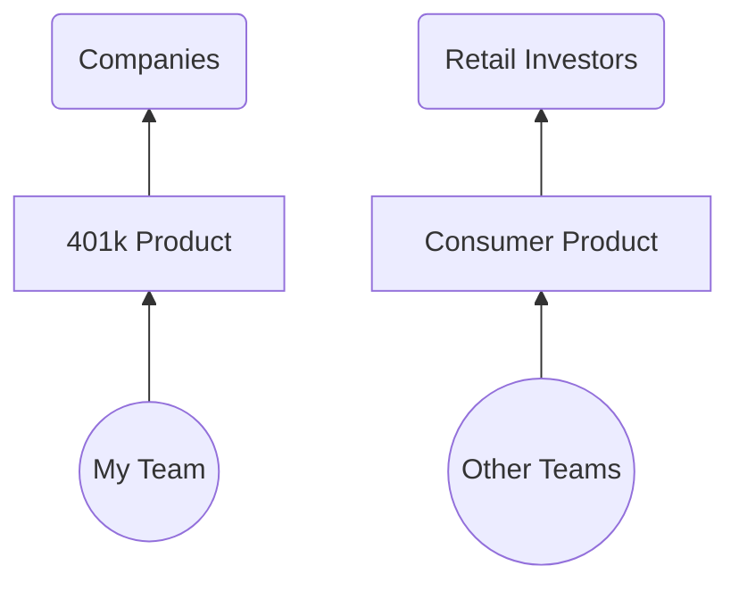
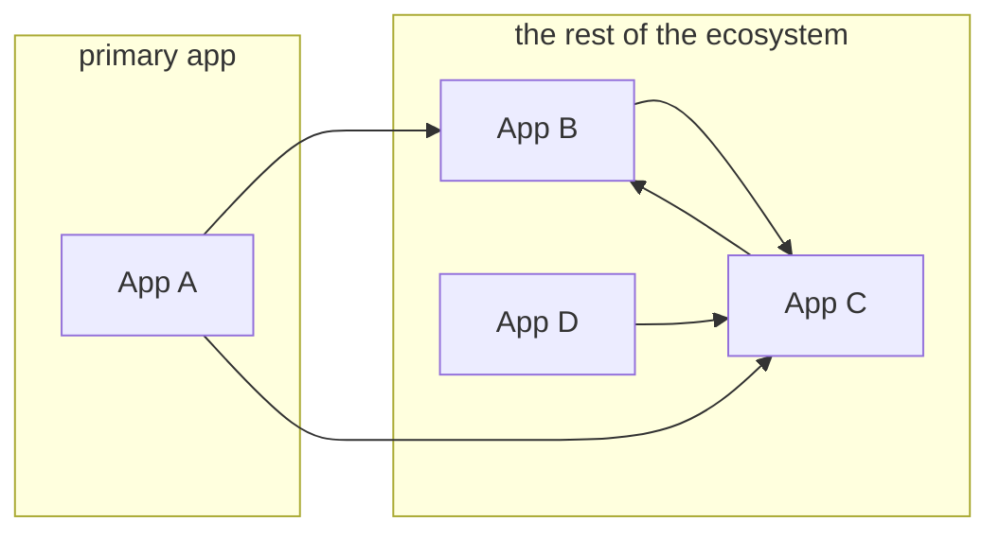
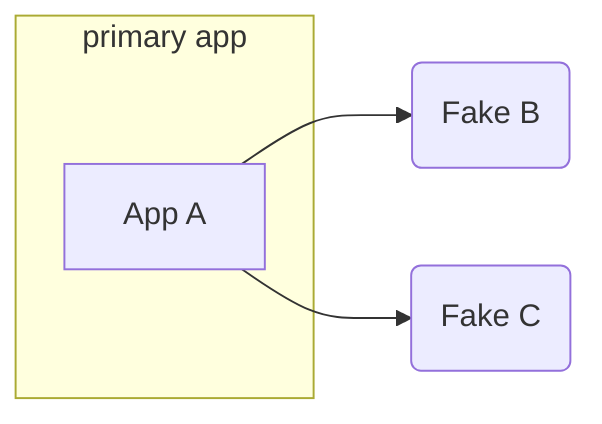
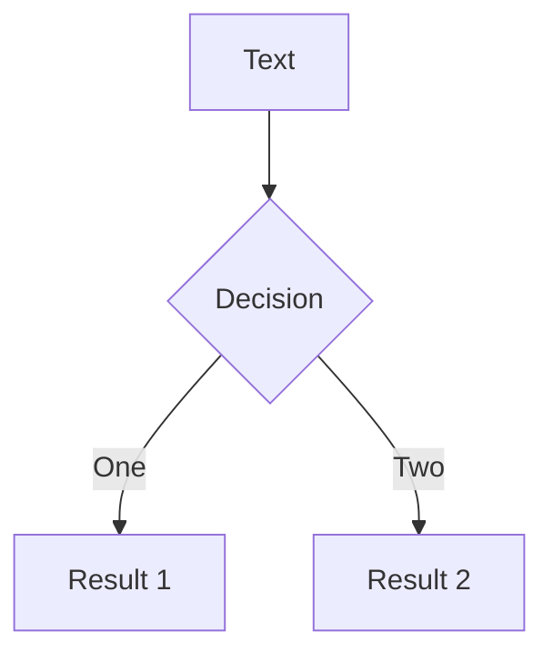

# **RAILS_ENV=demo**

#### unlocking the potential of the "demo" environment

<!--
Hello. Welcome. I'm glad to be here.
-->

---
layout: section
---

# RAILS_ENV=demo

<!--
Okay, so you might be here because of the title of the talk.
RAILS_ENV=demo
So just to unpack that a little, what I'm referring to is
-->

---
layout: fact
---

## **RAILS_ENV=demo** bundle exec rails s

<!--
the environment variable used to control the environment you start your Rails app in.
-->

---
layout: fact
---

## **RAILS_ENV=development** bundle exec rails s

<!--
Usually that's development
-->

---
layout: fact
---

## **RAILS_ENV=test** bundle exec rails s

<!--
test
-->

---
layout: fact
---

## **RAILS_ENV=production** bundle exec rails s

<!--
or production
-->

---
layout: fact
---

## **RAILS_ENV=staging** bundle exec rails s

<!--
and sometimes folks add things like staging environments
-->

---
layout: fact
---

## ~~**RAILS_ENV=staging** bundle exec rails s~~

<!--
but that's not actually standard
-->

---
layout: fact
---

## **RAILS_ENV={development, production, test}**

<!--
and so out of the box you get the big three
-->

---
layout: center
---

```bash
$ ls config/environments/

  development.rb
  production.rb
  test.rb
```

<style>
pre {
font-size: 200% !important;
line-height: 120% !important;
}
</style>

<!--
and of course these environments correspond to
files live in your config/environments folder
--> 

---
layout: center
---

### config/environments/production.rb

```ruby
Rails.application.configure do
  config.cache_classes = true
  config.eager_load = true

  config.consider_all_requests_local = false
  config.action_controller.perform_caching = true

  config.assets.compile = false

  config.log_level = :info
  config.log_tags = %i(request_id)

  # ...
end
```

<!--
and these files contain the instructions for how to run
these apps in that environment
-->

---
layout: fact
---

## RAILS_ENV={**demo**, development, test, production}

<!--
And so what I'm going to be talking about today is this idea
of adding a dedicated environment for giving application demos.
-->

---
layout: center
---


```bash {3}
$ ls config/environments/

  demo.rb
  development.rb
  production.rb
  test.rb
```

<style>
pre {
font-size: 200% !important;
line-height: 120% !important;
}
</style>

<!--
And so we're on the same page, it really starts with just adding that demo.rb file
to define the new environment.
-->

---
layout: section
---

# Why?

<!--
So why though? Why am I here, talking about environment files?

Well, speaking as someone who loves building Rails apps,
and has been building them for 14 years, I want to make it easy to show off
the things that I build. Like, to friends, coworkers, my parents, you name it.

And if you build Rails apps, you can probably relate to that. I'm sure my parents
would love to get a demo of your app.

But more specifically, I want to tell you the story of a demo
environment that I and my team have been working on for almost six years.
-->

---
layout: image-left
image: /images/me.jpg
---

# Nathan Griffith

GitHub: <a href="https://github.com/smudge">@smudge</a><br/>
Twitter: <a href="https://twitter.com/smudgethefirst">@smudgethefirst</a><br/>
Homepage: <a href="https://ngriffith.com">ngriffith.com</a>

<!--
And so, who am I?

Well, my name is Nathan. I exist online.

I also exist in real life, and work at a company called Betterment.
-->

---

# Betterment

<!--
You might've heard of us. We offer financial advice, investing accounts, checking,
retirement, you name it.

I like to think that our top product is financial peace of mind.
-->

---
layout: fact
---

# 2016

<!--
And the story I want to tell you starts in 2016, when I first joined the company.
-->

---




<!--
Now this is a huge oversimplification, but just to give you a sense,
we were a B2B team, building a B2B product,
and we, the team on the left, 
wanted to show off the product on the right,
to our clients (and prospective clients) there on the left.
-->

---

<div class="grid grid-cols-3">


<div>

# Decisions:

<v-clicks>

- **Services**  
- **Database**  
- **Users**  
- **Deployments**  
- **Ownership**  

</v-clicks>

</div><div>

# Demo v1

<v-clicks>

- all of them  
- refreshed nightly  
- fixtures/seeds  
- as needed
- single team  

</v-clicks>

</div>
</div>


<!--
…was deployed as a "complete" environment (alongside "demo"/sandbox instances of all external services and collaborators).
…relied on having pre-seeded, "known" accounts (which could be generated by fixtures or by sanitizing staging/production data), and was periodically wiped clean and reset.
…was deployed only weekly, then monthly, and then via "push button" (perhaps better described as "push button and cross fingers").
…was maintained solely by the team closest to the need for its existence (the team incentivized to do the work).
-->

---
layout: two-cols
---
# Demo v1

- ~~A complete service ecosystem~~
- Pre-seeded user accounts
- Infrequent deployments
- Managed by a specific team

::right::

# Demo v2

- A standalone Rails app with **Stateful Fakes**

---
layout: two-cols
class: text-center
---


# Without Fakes:

<v-click>




</v-click>

::right::


# With Fakes:

<v-click>



</v-click>

---

# How?

- Webmock
- WebValve

---

# WebValve

```ruby
class FakeBank < WebValve::FakeService
  get '/widgets' do
    json result: 'it works!'
  end
end
```

---

# "Stateful" Fakes

- Real database models, fake data

---


---
layout: image-right
image: https://source.unsplash.com/collection/94734566/1920x1080
---

# Code

---

# Components

---
class: px-40
---

# Two Columns

This is me, **testing a two col approach**

<div grid="~ cols-2 gap-2" m="-t-2">

```yaml
---
theme: default
---
```

```yaml
---
theme: seriph
---
```

# Test1

# Test2

<div>

- list 1
- yay
- boo

</div>

<div>

- list2
- boo
- yay

</div>

</div>

---
layout: center
class: text-center
---

<div class="grid grid-cols-3">

<div></div>



<div></div>

</div>


---
layout: center
class: text-center
---

# Learn More

[Documentations](https://sli.dev) · [GitHub](https://github.com/slidevjs/slidev) · [Showcases](https://sli.dev/showcases.html)
